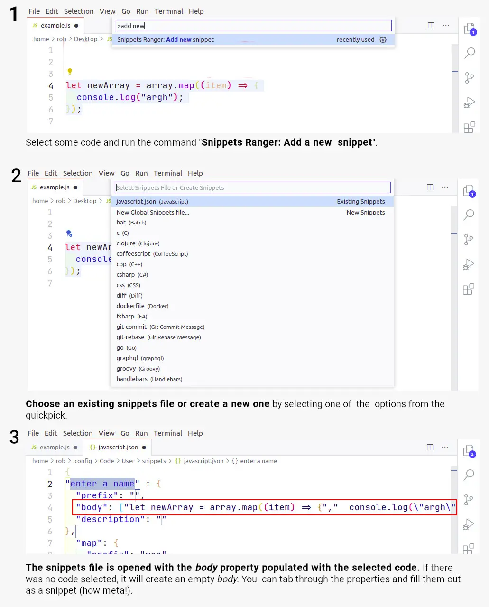

<h1 align="center">
   
    
   
	 
  Snippets Ranger
   
   
</h1>
<h4 align="center">View and edit all your snippets in one purty place. Yee-haw!</h4>

**Snippets are grouped as: *User*, *Extension*, and *VS Code*.**

The table of contents facilitates quick navigation to a snippets set. Pressing the <kbd>Home</kbd> key will return you to the table of contents.

There are sticky headings to ensure you can browse through long snippet lists without losing context. 🦎🔝

You can go to the source snippet file directly with the *View Source File* button. The extension uses **the exact same source files as VS Code**.

**Editing is a piece of cake**.🍰

The *Edit* action button will take you to the specific snippet in the source file to perform an edit. The *Delete* action button will delete the snippet straight away.

## Activation

The extension is only loaded when one of the commands are executed.

## Commands

The following commands can be run from the Command Palette (`Ctrl+Shift+P`):

1. **`Snippets Ranger: Show me that dur Range, Partner`**: Opens the view that lists all snippets.
1. **`Snippets Ranger: Add New Snippet`**: Quickly add a new snippet to a snippet file of your choosing.

## Performance

To gather and render approx 6000 snippets sourced from 18 different files, it takes 4.5 seconds on a modestly-specced 4-year old laptop running Ubuntu 18. 🚀

## Contribute

Contributions are welcome. If you have a suggestion or find a bug, please file an issue.

Please do not offer a PR without raising an issue first, my time for reviews are limited. You can [support me](https://ko-fi.com/roboleary) to increase my time available.

## Appreciate

You can show your appreciation by:
1. [Buying me a coffee or sponsoring me](https://ko-fi.com/roboleary)
1. Leaving a positive review in the [visual studio marketplace](https://marketplace.visualstudio.com/items?itemName=robole.snippets-ranger&ssr=false#review-details).
1. Starring the repo 🌟.

This will **help other people find the extension**. It will **offer me encouragement** to continue maintenance, and can provide **a path to dedicating more time to open-source** in the future.

## Learn more about snippets

You can read my comprehensive guide on Snippets on FreeCodeCamp: [Visual Studio Code Snippets – the Definitive VS Code Snippet Guide for Beginners](https://www.freecodecamp.org/news/definitive-guide-to-snippets-visual-studio-code/). It's not just for beginners! 😉
