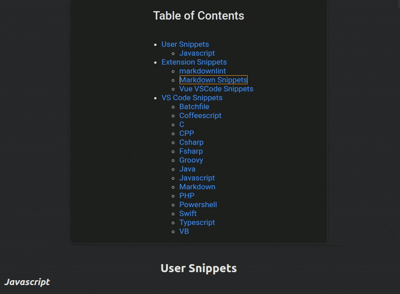
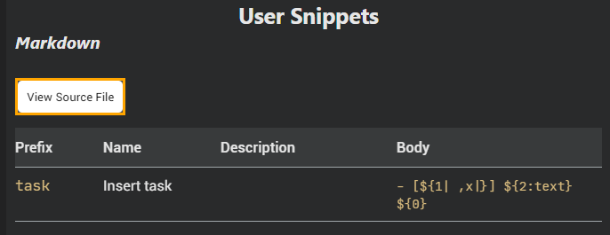
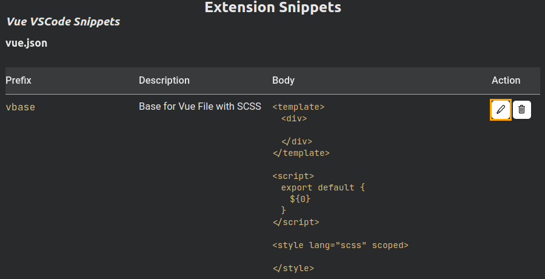
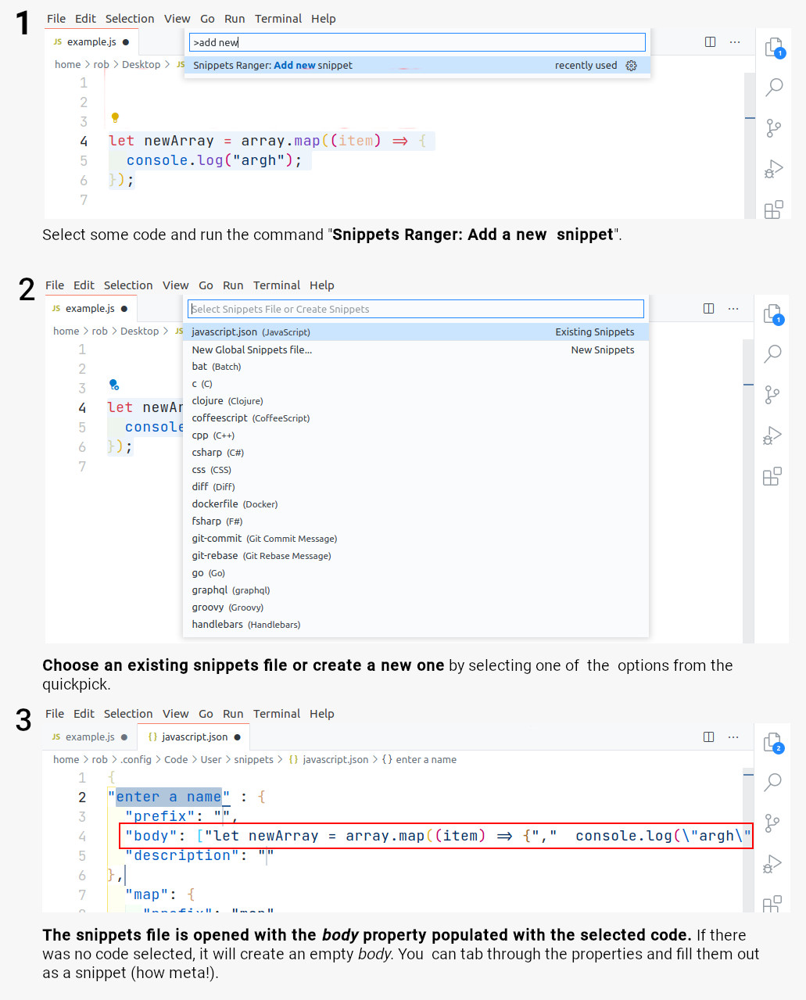

<h1 align="center">
   
    
   
	 
  Snippets Ranger
   
   
</h1>
<h4 align="center">View and edit all your snippets in one purty place. Yee-haw!</h4>

**Snippets are grouped as: *User*, *Extension*, and *VS Code*.**

The table of contents facilitates quick navigation to a snippets set. Pressing the <kbd>Home</kbd> key will return you to the table of contents.

There are sticky headings to ensure you can browse through long snippet lists without losing context. 🦎🔝

The snippet `body` is **prettily formatted**. 🌻✨

**You can go to the source snippet file directly** with the *View Source File* button.

**Editing is a piece of cake**.🍰 The *Edit* action button will take you to the specific snippet in the source file to perform an edit. The *Delete* action button will delete the snippet straight away.

## Activation

The extension is only loaded when one of the commands are executed.

## Commands

The following commands can be run from the Command Palette (`Ctrl+Shift+P`):

1. **`Snippets Ranger: Show me that dur Range, Partner`**: Opens the view that lists all snippets.
1. **`Snippets Ranger: Add New Snippet`**: Quickly add a new snippet to a snippet file of your choosing.

## Performance

To gather and render approx 6000 snippets sourced from 18 different files, it takes 4.5 seconds on a modestly-specced 4-year old laptop running Ubuntu 18. 🚀

## Installation

1. The extension is listed in the [VS Code Marketplace](https://marketplace.visualstudio.com/items?itemName=robole.snippets-ranger) and [Open VSX Marketplace](https://open-vsx.org/extension/robole/snippets-ranger) where you can download or install it directly.
1. From the Command-line: Run the command `code --install-extension robole.snippets-ranger`.
1. From the [VS Marketplace](https://marketplace.visualstudio.com/items?itemName=robole.snippets-ranger): Click the _Install_ button.

## Contribute

If you have a suggestion or find a bug, please file an issue.

## Show gratitude

If you are happy with the extension, please star the repo, and leave a review to help others find it. 🌟

You can [buy me a coffee](https://ko-fi.com/roboleary) if you would like to support me to make more great open-source software and tutorials. ☕🙏

## Learn more about snippets

You can read my comprehensive guide on Snippets on FreeCodeCamp: [Visual Studio Code Snippets – the Definitive VS Code Snippet Guide for Beginners](https://www.freecodecamp.org/news/definitive-guide-to-snippets-visual-studio-code/). It's not just for beginners! 😉
