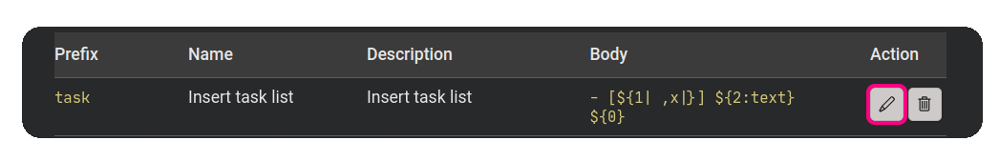
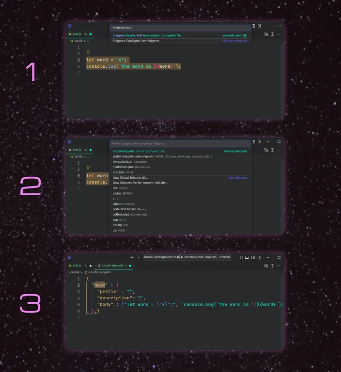

<h1 align="center">
   
    
   
	 
  Snippets Ranger
   
   
</h1>
<h4 align="center">View and edit all your snippets in one purty place. Yee-haw!</h4>

Snippets are shown in an **easy to read [webview](https://code.visualstudio.com/api/extension-guides/webview)**.

Snippets are formed into posses:
- ***Project***: These are the snippets contained in the `.vscode` folder of the current workspace,
- ***User***: These are the global snippet files (`.code-snippets` files) and language snippet files (`.json` files) that you created as an user on your system,
- ***Extension***: These are the snippets files that are included in extensions you have installed,
- ***App***: These are the snippets files that are packaged with VS Code.

The extension uses the exact same source files as VS Code does. No double-crossing rattlesnakes! 🐍

## Easy navigation

There are **sticky headings** to ensure you can browse through long snippet lists without losing context. 🦎🔝

The **table of contents** facilitates quick navigation to a snippets set.

	

Pressing the <kbd>Home</kbd> key will return you to the table of contents.

## Easy editing

You can **open the snippets file with the *View Source File* button** contained in the sticky header for every snippets file in the webview.

In the table, you can **edit each individual snippet with the buttons in the *Action* column**:
- The *Edit* action button (identified by the pen icon) will take you to the specific snippet in the source file to perform an edit.
- The *Delete* action button (identified by the trash icon) will delete the snippet straight away without opening the file.

If you are working in code and would like to **quickly add a snippet to a snippets file, you can use the `Snippets Ranger: Add new snippet to snippets file...` command**. It has 3 easy steps:
1. Select some code (no selection is fine too) and run the command,
1. Choose an existing snippets file or create a new file from the menu,
1. The file will be opened with a new snippet. Your selection will be in the `body` field as an array of values. You can tab through the properties to fill each one out.

## Commands

The following commands are available:

1. **`Snippets Ranger: Show me that dur Range, Partner`**: Opens the view that lists all your snippets.
1. **`Snippets Ranger: Add new snippet to snippets file...`**: Quickly add a new snippet to a snippet file of your choosing. If you have code selected, this selection will be added to the `body` of the snippet. Any dollar signs in the selection will be escaped (preceded by 2 backslashes) to prevent them being interpeted as tab stops.

## Activation

The extension is only loaded when one of the commands are executed.

## Performance

To gather and render approx 6000 snippets sourced from 18 different files, it takes 4.5 seconds on a modestly-specced laptop running Ubuntu 18. 🚀

## Contribute

Contributions are welcome. If you have a suggestion or find a bug, please file an issue. Please do not offer a PR without raising an issue first, my time for reviews are limited.

To help other people find the extension, you can [star the repo 🌟](https://github.com/robole/vscode-snippets-ranger), and leave a positive review in the [Visual Studio Marketplace](https://marketplace.visualstudio.com/items?itemName=robole.snippets-ranger&ssr=false#review-details) or [Open VSX Registry](https://open-vsx.org/extension/robole/snippets-ranger/reviews). A recommendation on social media or on your blog is welcome too!

You can [support me](https://ko-fi.com/roboleary) to make issues in this project a higher priority and allow me to dedicate more time I can dedicate to open-source projects.

## Learn more about snippets

You can read my comprehensive guide on Snippets on FreeCodeCamp: [Visual Studio Code Snippets – the Definitive VS Code Snippet Guide for Beginners](https://www.freecodecamp.org/news/definitive-guide-to-snippets-visual-studio-code/). It's not just for beginners! 😉
